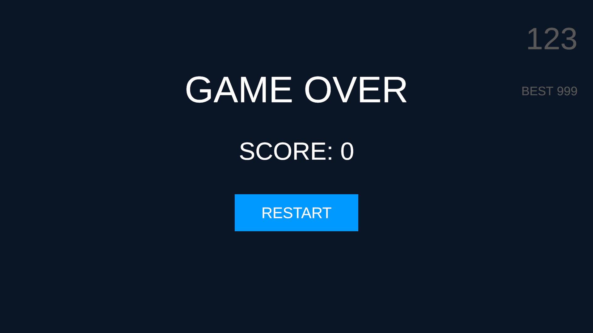

# puzzle-game

A high-performance, aesthetically pleasing "Block Blast" style puzzle game built with **Unity**.



## Features

- **Smooth Grid Mechanics**: Interactive 8x8 grid with optimized block placement validaton.
- **Dynamic Block Spawning**: Three unique blocks generated per set, ensuring varied gameplay.
- **Combo Scoring System**: Advanced scoring logic with multiplier-based combos for clearing multiple lines.
- **Modern UI/UX**: Premium dark-themed aesthetic with TextMeshPro integration and responsive feedback.
- **Persistence**: High score tracking using PlayerPrefs.
- **Game Optimization**: Built with the **New Input System** and efficient coroutine-based animations.

## How to Play

1. **Drag** the blocks from the bottom panel onto the 8x8 grid.
2. **Fill** vertical or horizontal lines to clear them and score points.
3. **Earn Combos** by clearing multiple lines simultaneously.
4. **Game Over** occurs when no valid moves are left for the current set of blocks.
5. **Restart** anytime to beat your high score!

## Technical Details

- **Engine**: Unity 2022.3+ (LTS) / Unity 6
- **Language**: C#
- **Input**: New Input System (UnityEngine.InputSystem)
- **UI**: Unity UI Toolkit / TextMeshPro

## Installation

1. Clone the repository:
   ```bash
   git clone https://github.com/yagizzcakir/puzzle-game.git
   ```
2. Open the project in Unity Editor.
3. Load `Assets/Scenes/SampleScene.unity`.
4. Press **Play**.
